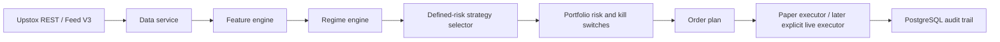

# Architecture and delivery roadmap

## Design

Signal code must never place orders directly. A future order plan must pass data-quality, liquidity, cost, regime, available-capital, exposure, and drawdown gates before it reaches an executor.

## Modules

| Module | Responsibility | Status |
|---|---|---|
| `app/config` | Typed environment configuration; explicit LIVE guard | Implemented |
| `app/database` | SQLAlchemy metadata and Alembic foundation | Implemented |
| `app/broker/upstox.py` | OAuth, instrument download, historical candles | Implemented, REST only |
| `app/data/instruments.py` | BOD master normalization/upsert | Implemented |
| `app/data/streaming.py` | Feed V3 binary subscribe protocol, stale/duplicate guards | Implemented |
| `app/broker/upstox_feed.py` | Official SDK V3 protobuf decoder, normalized ticks, bounded reconnect adapter | Implemented; token-required live smoke test pending |
| `app/data/ohlcv.py` | IST-aligned tick-to-OHLC aggregation | Implemented; persistence worker pending |
| `app/features` | Trend, momentum, realized volatility, VIX/cross-asset metrics | Implemented |
| `app/regimes` | Explainable initial rule regime classification | Pending |
| `app/options` | Option-chain assessment and defined-risk payoff calculation | Pending |
| `app/risk` | Limits, CVaR, kill switches, exposure control | Pending |
| `app/execution` | Idempotent paper fills; live adapter behind hard guard | Pending |
| `app/backtest` | Cost-aware, walk-forward backtest | Pending |

## Database plan

The initial migration creates these foundation tables:

- `instruments`: dynamic master with fields required to resolve active futures/options safely.
- `oauth_states`: expiring, one-time OAuth states. No token or secret is stored.
- `system_events`: append-only operational/audit events.

Planned migrations must add `market_ticks`, `ohlcv`, `option_chain_snapshots`, `features`, `regimes`, `signals`, `orders`, `order_events`, `positions`, `portfolio_snapshots`, `risk_events`, `hedges`, `backtest_runs`, `backtest_trades`, `strategy_parameters`, and `audit_logs`. Times must be `timestamptz`, source timestamps normalized to Asia/Kolkata at ingestion, and quotes/candles partitioned by date before production scale.

## Strategy order

1. Data integrity and feature calculation using NIFTY 50, India VIX, and liquid current NIFTY option contracts.
2. Rules-based regime: `BULL_TREND`, `BEAR_TREND`, `RANGE`, `HIGH_VOL_TREND`, `VOL_SHOCK`, `CRISIS`.
3. Defined-risk NIFTY debit spreads (bull-call / bear-put) plus tactical protective puts. No naked option selling by default.
4. A cost-aware event-driven backtest with train/validation/out-of-sample and walk-forward checks.
5. Paper execution, reconciliation, dashboard and alerts.
6. Live mode only after a separately reviewed risk checklist; the feature flag alone is not authorization to trade.

## Backtest assumptions to implement

Do not report performance until data has been downloaded and a run artifact exists. Each run needs source/date range, instrument master version, parameter hash, code revision, fee/slippage assumptions, trade ledger, equity curve, and out-of-sample metrics. The first options backtest requires historical option premiums/quotes; this is not yet confirmed from Upstox and is therefore **DATA UNAVAILABLE** until validated/downloaded.
